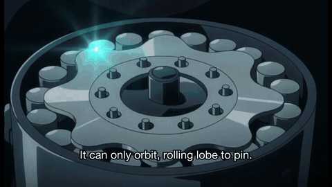
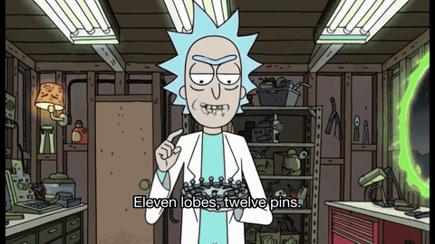
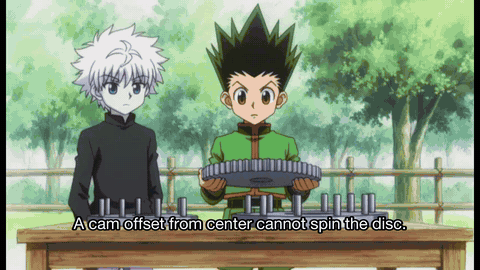
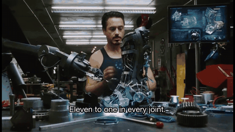
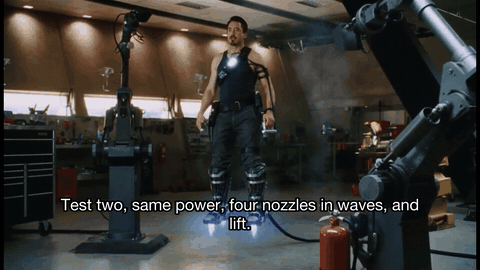

# jjk-explain

Explain any concept as a ~60 second video in one of five voices: the Jujutsu Kaisen narrator revealing a cursed technique, a tea-shop lesson from Uncle Iroh, Rick ranting at Morty in the garage, Tony Stark testing it in the workshop with JARVIS, or the Hunter x Hunter narrator freezing the frame to state the rule. Original characters (or your own robot, or a referenced likeness), real narrator cadence, title cards, generated footage, lip-synced dialogue. One Claude Code command.

<table>
<tr>
<td width="33%"></td>
<td width="33%"></td>
<td width="33%"></td>
</tr>
<tr>
<td align="center"><code>/explain cycloidal drives</code> (JJK narrator, turbo, $0.28)<br><a href="https://github.com/gshklovs/jjk-explain/releases/download/v1.2/cycloidal-drive.mp4">▶ full video (81 s)</a></td>
<td align="center"><code>/explain-rick cycloidal actuators</code> (seeded, two voices)<br><a href="https://github.com/gshklovs/jjk-explain/releases/download/v1.2/cycloidal-actuators-rick.mp4">▶ full video (57 s)</a></td>
<td align="center"><code>/explain-hxh cycloidal actuators</code> (seeded, off-screen narrator)<br><a href="https://github.com/gshklovs/jjk-explain/releases/download/v1.2/cycloidal-actuators-hxh-seeded.mp4">▶ full video (93 s)</a></td>
</tr>
<tr>
<td width="33%"></td>
<td width="33%"></td>
<td width="33%"></td>
</tr>
<tr>
<td align="center"><code>/explain-stark cycloidal actuators</code> (workshop test, real-footage seed)<br><a href="https://github.com/gshklovs/jjk-explain/releases/download/v1.2/cycloidal-actuators-stark-2.mp4">▶ full video (88 s)</a></td>
<td align="center"><code>/explain-stark</code> why a startup is suddenly everywhere<br><a href="https://github.com/gshklovs/jjk-explain/releases/download/v1.2/everywhere-launch-stark.mp4">▶ full video (68 s)</a> · <a href="https://x.com/0xfjuan/status/2095192939169234945?s=10">the post on X</a></td>
<td align="center"><code>/explain ik</code> with a reference image of the user's robot<br><a href="https://github.com/gshklovs/jjk-explain/releases/download/v0.1/inverse-kinematics.mp4">▶ full video (85 s)</a></td>
</tr>
</table>

> *Cursed Technique: Inverse Kinematics. The user does not choose the angles of its joints. It chooses only where the hand must arrive.*
> ...
> *Its binding vow is damping. Near a singularity, where the arm locks straight and the map collapses, the user surrenders exactness for stability, and the joints stay calm.*

Full examples with scripts and transcripts: [inverse kinematics](examples/inverse-kinematics/), [gradient descent](examples/gradient-descent/), [the fold flywheel](examples/fold-flywheel/).

## v1.1

- **`/explain-iroh`**: the same pipeline as a warm tea-shop lesson from an old firebending master to a stuck student (or straight to the viewer). Own bible ([skills/explain-iroh/reference.md](skills/explain-iroh/reference.md)), parchment title cards with brush calligraphy, a 2000s East-Asian-influenced style lock, its own fish.audio voice. Both skills share one renderer; a top-level `"style": "jjk" | "iroh"` in script.json selects the style table (style lock, title card, voice, music, pacing). Full example: [examples/how-llms-learn-iroh/](examples/how-llms-learn-iroh/), [▶ video](https://github.com/gshklovs/jjk-explain/releases/download/v1.1/how-llms-learn-iroh-3.mp4).
- **Character likeness**: `"refs": [stills]` plus `"seed"` route a scene to `minimax/h3-max/reference-to-video` (up to 9 reference images; the renderer cites them as "Image 1 to Image N show the same character"). `"ref_videos"` adds motion reference. The `"image"` first-frame path still works. Stills live in gitignored `assets/ref/<style>/`; generate them with an image model or crop them from stills you own.
- **Lip sync**: `"lipsync": true` passes each scene's narration wav as reference audio; the model re-speaks the line in that voice while animating the mouth, and the mix keeps the model's track (`"lipsync_audio": "model"`) because the model drifts after sentence pauses if you overlay the original narration.
- **Lean mode** (Iroh default): a single `voice_sample` wav sets the voice, the prompt carries the words, and no per-scene TTS runs at all. Fish is only needed once, to make the sample. Title cards are silent over music.
- **Speaker tags**: `[zuko] Uncle, does it think? [iroh] No.` in narration maps to per-speaker fish.audio voices (the `voices` table in each style). Tags are stripped from captions.
- **Model and resolution**: `--model h3-max-turbo|h3-max`, `--resolution 480P|768P`, script-level `"model"` / `"resolution"`, or `EXPLAIN_MODEL` / `EXPLAIN_RESOLUTION`. Defaults are `h3-max-turbo` at `480P`, the cheapest combination. Scenes that need references (refs, ref_videos, lipsync, lean) are routed to `h3-max` automatically, since turbo has no reference endpoint. Prices per second, regular: turbo $0.025 (480P) / $0.04 (768P); h3-max reference-to-video $0.08 at either resolution, so reference scenes are always requested at 768P whatever `--resolution` says (`EXPLAIN_REF_RESOLUTION` overrides).
- **Music and pacing per style**: beds in `assets/<style>/`, chosen per script with `"music": "<substring>"`; TTS speed and sentence pause are per-style (`fish_speed`, `pause`).
- **`/explain-stark`**: an armored inventor explains a concept while building it in his workshop, bantering with a dry British AI. Live-action cinematic style lock, English-only HUD title cards, two voices (`[stark]` / `[ai]` tags), no music by default, and style-level default reference stills (`assets/ref/stark/`, seed 42; `"refs": []` opts out). Bible: [skills/explain-stark/reference.md](skills/explain-stark/reference.md).
- **`/explain-rick`**: a drunk genius scientist explains a concept to his nervous grandson in a garage laboratory full of gadgets (Rick and Morty style). Own bible ([skills/explain-rick/reference.md](skills/explain-rick/reference.md)) with registers `rick-lecture`, `rick-annoyed`, `rick-drunk-genius`; a flat-colour adult-animation style lock; acid-green English title cards; two voice samples in lean mode (`[rick]` / `[morty]` tags pick the sample per scene, no TTS); no music by default (a style-level `music: None`); default reference stills for both characters (`assets/ref/rick/`, seed 4242, `ref_owners` tells the model which images are which character); a per-style `words_per_sec` for the lean timing. Every shot goes through reference-to-video, so a 6-scene lesson is about $4-6. Research notes: [docs/rick-research.md](docs/rick-research.md).
- Renders in this release: [how LLMs learn (JJK)](https://github.com/gshklovs/jjk-explain/releases/download/v1.1/how-llms-learn.mp4), [robot balancing policies (JJK, Nanami register)](https://github.com/gshklovs/jjk-explain/releases/download/v1.1/robot-balance.mp4), [how LLMs learn (Iroh, likeness + lip sync, 480P)](https://github.com/gshklovs/jjk-explain/releases/download/v1.1/how-llms-learn-iroh-3.mp4).

## v1.2

- Five styles in one renderer, selected by `"style"` in script.json: `jjk`, `iroh`, `rick`, `stark`, `hxh`. The seeded ones (Rick, Stark, HxH) use reference stills cut from real footage and clip-cut voice samples in lean mode, so nobody is described in prompts, only shown.
- **Object references**: `"objects": {path: label}` on a script or scene adds images of the thing itself (a drive, a gripper, an engine) after the character stills; without one the first cycloidal drive rendered as a spur gear. The skills now fetch 2-3 object images before writing the script.
- **Off-screen speakers**: `"offscreen": ["ai"]` renders that speaker's scenes silent and voices the line with its fish.audio voice, so no mouth on screen can be animated (JARVIS).
- **Timed captions**: in lean mode captions are cut from Whisper word timestamps on each clip's own audio instead of a word-count estimate.
- Reference-to-video is always requested at 768P (same price as 480P). Bibles gained three rules every style follows: narration is never stage direction, the one number is said once and every other line states a distinct property, and mechanism beats show the thing being taken apart.
- Renders in this release: the five in the table above.
- **`/explain-hxh`**: the same pipeline as a calm omniscient-narrator lecture in the manner of a 2011 shonen adventure anime's power explanations: the action freezes, a glowing outline and a schematic are drawn over the characters, and the rule, its condition, its one number and its exception ("However.") are stated like law. Own bible ([skills/explain-hxh/reference.md](skills/explain-hxh/reference.md)) with three registers (`hxh-lecture`, `hxh-ominous`, `hxh-rules`), cream schematic title cards with a 念 seal, an early-2010s bright-cel style lock, its own fish.audio narrator voice (`HXH_FISH_VOICE_ID` overrides), and three beds in `assets/hxh/` picked with `"music": "lecture" | "ominous" | "rules"`. Plain narration over turbo clips, like `/explain`: no lip sync, no references, so a 60-75 s video costs about $1.50 at regular pricing. `"style": "hxh"` in script.json selects it. Research notes: [docs/hxh-research.md](docs/hxh-research.md).

## What the human does

Two API keys. Both are card-on-file, pay-as-you-go, no approval process:

1. **fal.ai** key from https://fal.ai/dashboard/keys. Runs MiniMax H3-Max and H3-Max Turbo, the video models. With the defaults (turbo, 480P) a 60 s JJK video is about $1.50 at regular pricing and pennies during fal promos; an Iroh lesson with likeness and lip sync is about $5 (reference-to-video is $0.08/s at any resolution).
2. **fish.audio** key from https://fish.audio/app/developers, then top up API credit on the same page. This is the narrator voice. A whole video costs about one cent. API credit is separate from a fish.audio subscription. For `/explain-iroh` in lean mode, Fish is only used once to record a voice sample.

Optional: any music file dropped into `assets/` (JJK) or `assets/iroh/` (Iroh; three beds are picked by name with `"music"`). The canonical bed is the "Delirious" 1 hour loop from the JJK OST; fine for personal use, expect a Content ID claim if you upload.

## What the agent does

Everything else. Point Claude Code (or any agent) at this repo and say "set this up"; [AGENTS.md](AGENTS.md) has the steps. By hand:

```bash
git clone https://github.com/gshklovs/jjk-explain && cd jjk-explain
./install.sh                      # symlinks skills/explain into ~/.claude/skills
cp .env.example .env              # add the two keys
brew install ffmpeg               # if missing
pip install -r requirements.txt
```

Then in Claude Code:

```
/explain gradient descent
/explain the thing we just debugged
/explain raft consensus --register nanami --tier full
/explain-iroh how language models learn
/explain-rick cycloidal actuators
```

The skill writes `out/<slug>/script.json` (the narrator script plus one video prompt per scene), renders, and opens the mp4. Outputs land in `out/<slug>/render/`: the mp4 with an embedded thumbnail, `thumb.jpg`, `transcript.md`, `captions.srt`, and every intermediate clip and narration file so reruns are free.

## How it works

```
concept ─► Claude writes script.json (reference.md is the bible: beats, registers, taxonomy, style lock)
           │
           ├─ narration: fish.audio "jjk narrator" voice, one call per sentence, stitched with real silence
           ├─ title cards: ffmpeg, black + brush kanji + english (never asked of the video model)
           ├─ shots: fal minimax/h3-max/text-to-video, 5-15 s each, native ambience, parallel
           │
           └─ ffmpeg: fit each clip to its narration ─► concat ─► music bed with sidechain ducking
                      ─► burned captions ─► brightest domain-reveal frame as cover art
```

The metaphor structure is fixed by a small taxonomy: cursed energy is the input, the innate technique is the core mechanism, the domain is the environment plus its guarantee, the binding vow is the tradeoff, and the weakness is the crack. `--tier technique|domain|full` picks how many beats a concept gets. `--register narrator|sukuna|nanami|gojo` picks who is explaining.

## Renderer flags

```
python3 skills/explain/scripts/render.py out/<slug>/script.json [--voice fish|onyx] [--model h3-max-turbo|h3-max]
        [--resolution 480P|768P] [--dry-run] [--music FILE] [--narration FILE] [--no-captions] [--jobs N]
```

`--dry-run` renders everything with placeholder clips and zero fal spend, the right way to check a script. `--narration` uses one recorded take instead of TTS, scenes timed by word count. Reruns reuse every cached file, so tweaking the music or a single scene costs only that scene.

## Layout

```
skills/explain/SKILL.md        the Claude Code skill
skills/explain/reference.md    the bible: narrator beats, registers, taxonomy, style lock, prompt rules
skills/explain/scripts/render.py   shared renderer (STYLES and MODELS tables at the top)
skills/explain-iroh/SKILL.md   the Uncle Iroh skill
skills/explain-iroh/reference.md   its bible: beats, registers, tiers, style lock, title cards, sound
skills/explain-hxh/SKILL.md    the freeze-frame narrator skill
skills/explain-hxh/reference.md    its bible: the feel, beats, registers, diagram presets, title card
skills/explain-stark/SKILL.md  the workshop inventor skill
skills/explain-stark/reference.md  its bible: beats, registers, tiers, style lock, HUD title cards, sound
skills/explain-rick/SKILL.md   the garage-lab skill
skills/explain-rick/reference.md   its bible: how he teaches, beats, registers, tiers, style lock, cast, title cards, sound
examples/                      finished scripts with transcripts, both styles
eval/cases.json                real ELI5 asks used as test inputs
docs/research.md               model/voice/format research behind the design (Sept 2026)
assets/  out/                  gitignored: music beds, reference stills, voice samples, renders
```

## Notes

- macOS first. Title cards use Hiragino Mincho; on Linux set `EXPLAIN_JP_FONT` to a font with kanji glyphs (Noto Serif CJK JP) and `EXPLAIN_EN_FONT`.
- fal promo pricing on H3-Max (about a quarter of the regular rate) was running through early September 2026.
